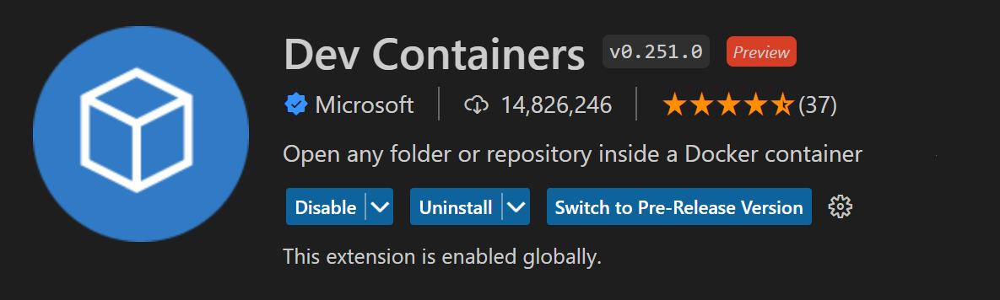

# Node 16 and Docker.
This repo covers information regard with Node 16 and Docker containers.

  
  

## Description.

This Node image was built using Docker. It means that you can pull this repo or fork it, create the Docker container and once is finished, you can create your own apps where you need Node 16.
It covers only the basics, and then, you will create your own projects starting from this one. Feel free to change anything you need or failures you have.

### VS Code.

You must have the **Dev Containers** extension install in your VS Code to build this docker container and select **Rebuild docker container whitout cache and reopen in a container**.

  

## Steps.

1. Clone repo.
2. Open VS code.
3. Make sure to have docker running and the Dev Containers extension installed.
4. Select **Rebuild** option.
5. Wait until is finish.
6. Enjoy!

## Quick Notes.

By default, the container will open the project using the **jorge** user. You can change it by modifying the Dockerfile and the script.sh, in order to give sudo permissions.

* Dockerfile:

  

* script.sh:

  

## Author.

* Jorge Ortiz.
* San Luis Potosí, S.L.P. México.
* ortiz.mata.jorge@gmail.com
